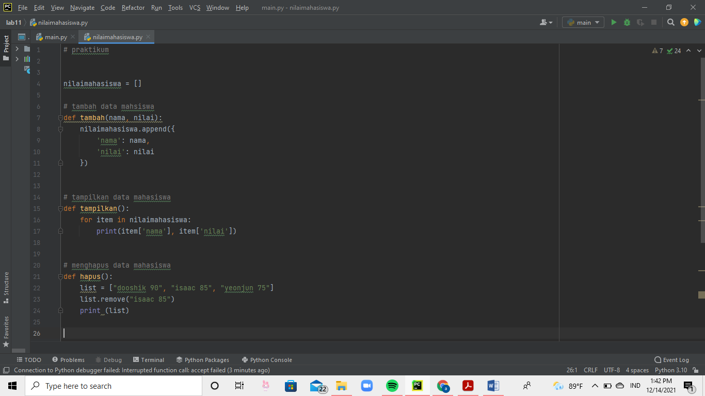
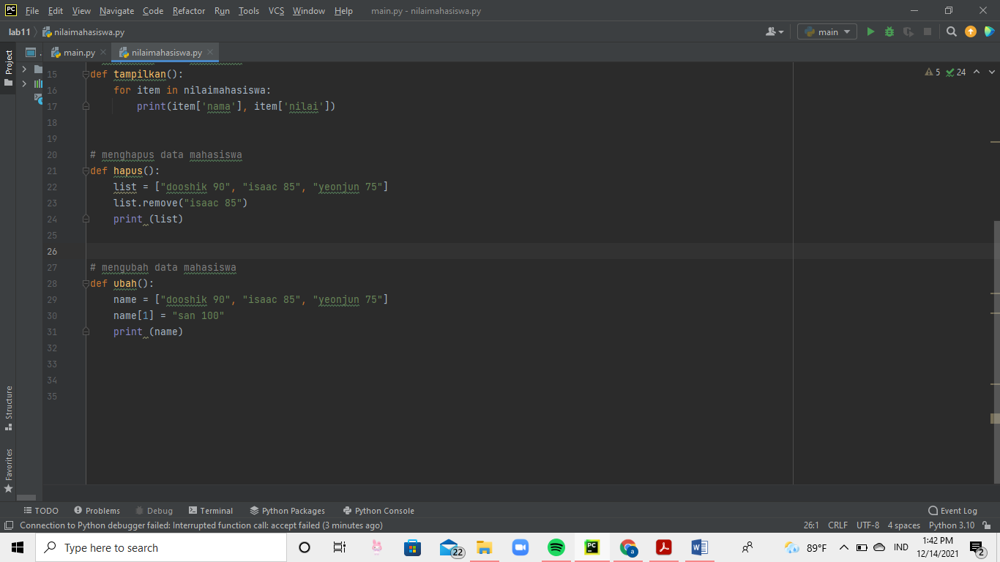
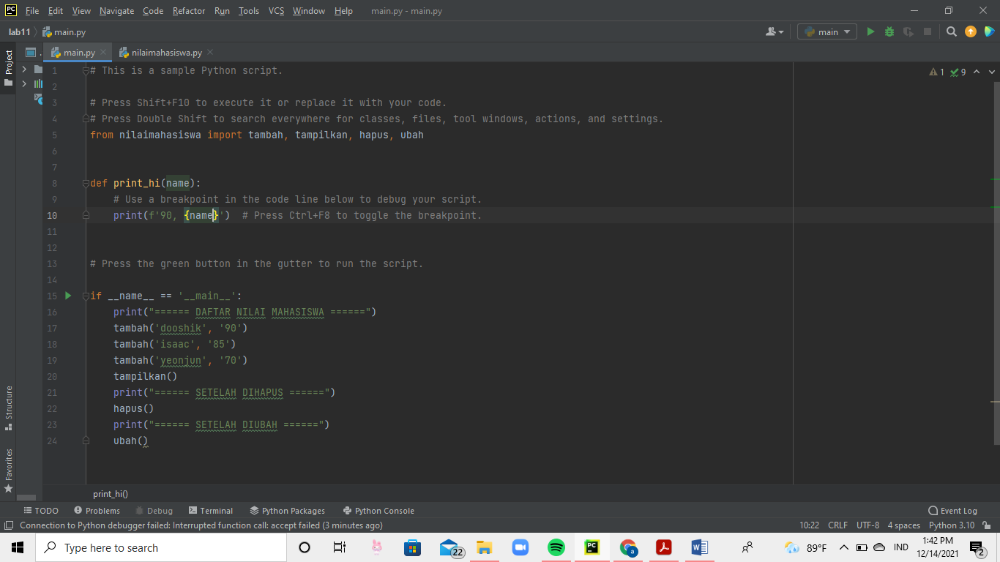
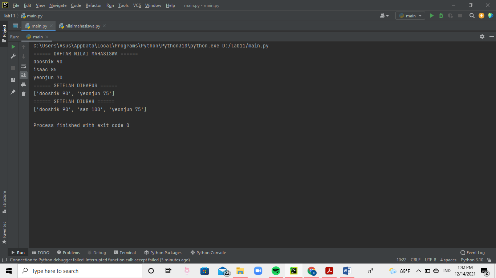

# project11

## Menampilkan Data Mahasiswa 

### Tambah data

kode program tambah data adalah 

ketik def lalu enter, .append({}) 

### Tampilkan data

kode program tampilkan adalah 

ketik def, for in : 

lalu print 

--- LANJUTAN --- 

### Hapus data 

kode programnya adalah 

.remove() 

lalu di print() 

### Ubah data

kode programnya adalah 

[] = " 

### Lanjutan 

hasil outputnya akan menjadi seperti ini 

